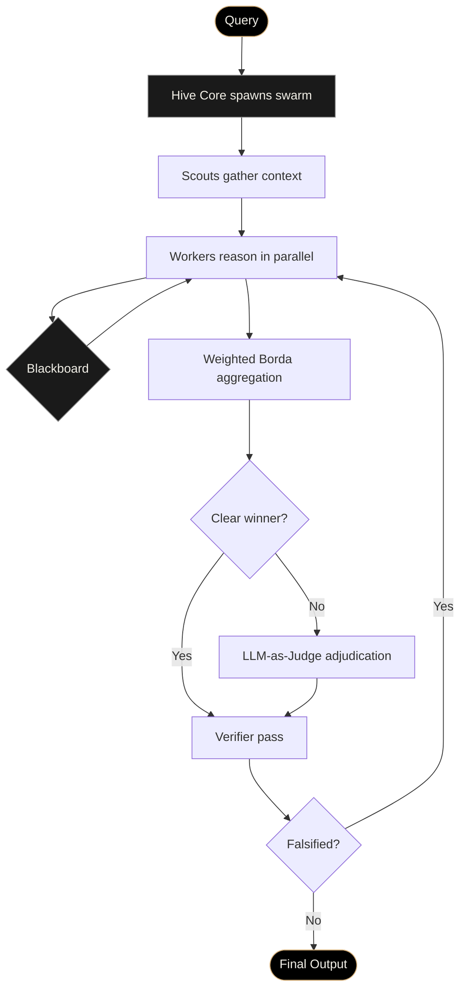

<div align="center">

```
                            ╱─────────────────╲
                          ╱     ✦       ✦       ╲
                        ╱   ◯─────────────────◯   ╲
                       │  ╱                     ╲  │
                       │ │    ⊙             ⊙    │ │
                       │ │       ╲       ╱       │ │
                       │ │        ╲     ╱        │ │
                       │ │    ─────●─────        │ │
                       │ │        ╱     ╲        │ │
                       │ │       ╱       ╲       │ │
                       │  ╲                     ╱  │
                        ╲   ◯─────────────────◯   ╱
                          ╲     ✦       ✦       ╱
                            ╲─────────────────╱
```

# **OPUS**

### ⸻ *Ars Magna* ⸻

***A Bio-Inspired Multi-Agent Swarm Architecture for Collective Reasoning***

<br>

> *Where one model answers, the swarm deliberates.*
> *Where one model guesses, the swarm proves.*

<br>

**[📜 Read the Whitepaper](./Opus_Whitepaper_v0.1.pdf)** &nbsp;·&nbsp;
**[🐝 Follow the Build](#status)** &nbsp;·&nbsp;
**[⚙ Architecture](#the-beehive-brain)** &nbsp;·&nbsp;
**[🜂 Lineage](#lineage)**

</div>

---

## ✦ &nbsp; What Is Opus?

**Opus is not a model. It is a colony.**

A swarm of specialised agents reasoning in parallel, coordinating through a shared cognitive substrate, and converging on truths no single mind could reach alone.

Where one model produces a single trajectory of thought — biased by its first tokens, constrained by its prompt, blind to its own errors — a swarm produces a **dialectic**. Researchers generate hypotheses. Critics attack them. Synthesisers merge what survives. Verifiers attempt to falsify the result. The answer that emerges is not a guess refined into prose, but a **consensus refined out of disagreement**.

This is *Ars Magna* — the Great Work — rebuilt in code.

---

## 🜂 &nbsp; The Beehive Brain

```

   ┌─────────────────────────────────────────────────────────────┐
   │                                                             │
   │     SCOUT TIER       →   Exploration · Retrieval · Sensing  │
   │         ↓                                                   │
   │     WORKER TIER      →   Hypothesis · Critique · Synthesis  │
   │                          Planning · Execution · Verification│
   │         ↓                                                   │
   │     HIVE CORE        →   Orchestration · Consensus · Output │
   │                                                             │
   └─────────────────────────────────────────────────────────────┘

```

### The Three Tiers

| Tier             | Role                                                                                          | Population         |
| :--------------- | :-------------------------------------------------------------------------------------------- | :----------------- |
| 🔍 **Scouts**    | Lightweight retrieval agents that enlarge the perimeter of available information              | 8 – 32 per run     |
| 🐝 **Workers**   | Specialised reasoning agents — Researcher, Critic, Synthesiser, Planner, Executor, Verifier   | 12 – 48 per run    |
| 🜔 **Hive Core** | Orchestrator and consensus layer — never reasons, only conducts                               | Singleton          |

### The Three Principles

> **① Parallel Exploration** — N specialised agents, each pursuing a different hypothesis, simultaneously.
>
> **② Stigmergic Memory** — Agents communicate indirectly through a shared workspace. Pheromones for code.
>
> **③ Consensus Synthesis** — Partial solutions cross-evaluated, pruned, and merged into a single emergent answer.

---

## ⚙ &nbsp; How a Swarm Run Works



A query enters. The Hive Core spawns Scouts to gather context, then Workers to deliberate. Workers write hypotheses, critiques, and partial syntheses to a shared **Blackboard** — they never speak to one another directly. Their rankings feed a weighted Borda count. Ties trigger a Judge. The winner faces a Verifier that attempts falsification. Only then does an answer leave the colony.

---

## 🜍 &nbsp; The Stack

<div align="center">

|                  Layer | Component                                                                |
| ---------------------: | :----------------------------------------------------------------------- |
|           **LLM Core** | Claude Opus 4.7 · Claude Sonnet 4.6 *(cost-tiered per role)*             |
|      **Orchestration** | `asyncio` + `anyio` event bus · supervisor pattern                       |
|       **Vector Store** | Qdrant *(default)* · Weaviate · pgvector                                 |
|        **Graph Store** | Neo4j Community Edition                                                  |
|         **Blackboard** | Redis-backed append-only event log · optimistic concurrency              |
|            **Runtime** | Modal *(ephemeral)* · Ray *(persistent cluster)*                         |
|      **Observability** | OpenTelemetry · per-agent reasoning logs · token-level provenance        |
|           **Front-end** | Next.js 14 · React Three Fiber · GSAP                                   |
|         **Deployment** | Vercel *(edge)* · Fly.io *(agent runtime)*                               |

</div>

---

## 🐝 &nbsp; The Daily Build

Opus is being **live-coded in public**. Every commit, every refactor, every architectural pivot — broadcast.

<br>

</div>

---

## 🗺 &nbsp; Roadmap

```
  ●─────●─────○─────○─────○
  α     β     γ     δ     ∞
```

| Phase           | Status           | Milestone                                                                            |
| :-------------- | :--------------- | :----------------------------------------------------------------------------------- |
| **α — Genesis** | 🟢 **Live**       | Single-machine swarm · 3 Worker roles · naive consensus · daily public build         |
| **β — Cohort I**| ⚪ Queued         | Distributed runtime · 6 Worker roles · full stigmergic Blackboard · private beta     |
| **γ — Cohort II**| ⚪ Queued        | Full Judge + Verifier pipeline · observability dashboard · public beta · run gallery |
| **δ — Open**    | ⚪ Queued         | Third-party agent integrations · community Worker marketplace · whitepaper v1.0      |

---

## 🜔 &nbsp; Lineage

Opus does not invent. It synthesises a long lineage of human attempts to build collective intelligence.

```
       1280s ───────── Ramon Llull — Ars Magna
                         (combinatorial reasoning wheels)
                                  │
       1970s ───────── Hearsay-II
                         (blackboard architectures)
                                  │
       1987  ───────── Reynolds — Boids
                         (emergent flocking)
                                  │
       1992  ───────── Dorigo — Ant Colony Optimisation
                                  │
       1995  ───────── Kennedy & Eberhart — Particle Swarm
                                  │
       2023  ───────── Multi-Agent LLM Frameworks
                                  │
       2026  ───────── ✦  OPUS
```

The architecture descends, conceptually, from Llull's thirteenth-century wheels — the first serious attempt to mechanise reasoning by combination. It descends, algorithmically, from ant colonies, particle swarms, and the boids of Craig Reynolds. It descends, in software-engineering form, from the blackboard architectures of Hearsay-II. And it descends, in spirit, from the alchemical *magnum opus*: the slow refinement of base material into something rare.

> *Solve et coagula. Dissolve and re-form.*
> *The colony reasons by separation and recombination.*

---

## 📜 &nbsp; The Whitepaper

The full technical schematic — architecture, consensus mechanism, cognitive substrate, reference implementation, lineage.

<br>

<div align="center">

### **[📜 &nbsp; READ THE WHITEPAPER &nbsp; 📜](./Opus_Whitepaper_v0.1.pdf)**

*v0.1 · Magnum Opus · MMXXVI*

</div>

---

## 🛠 &nbsp; Status

```
  CURRENT PHASE:    α — Genesis
  BUILD STATUS:     Live-coded daily
  CODEBASE:         Closed (will open at Phase β)
  WHITEPAPER:       v0.1 published
  ACCESS:           By invitation
```

This repository will progressively open as the project moves through its phases. The whitepaper and brand assets are public from day one. The codebase opens at Phase β. Watch this space.

---

## 🤝 &nbsp; Join the Hive

Opus is being built in public, by one person, in real time. If the work resonates — if you want to watch a multi-agent reasoning system get built from first principles, with the work shown — there are three things you can do:

1. **⭐ Star this repo** — and watch the colony grow.
2. **🐝 Follow the daily build** on [X](https://x.com/0pusAI)
3. **📬 Request early access** — drop a note on X with the word `VIITE`.

---

## ⚖ &nbsp; License

All rights reserved · *(license to be finalised at Phase β)*

The whitepaper is released under CC-BY 4.0 — quote freely, attribute *Opus · Ars Magna · 2026*.

---

<div align="center">

```
                            ╱─────────────────╲
                          ╱                     ╲
                        ╱        OPUS              ╲
                       │                            │
                       │      ARS · MAGNA           │
                       │                            │
                        ╲                          ╱
                          ╲                       ╱
                            ╲─────────────────╱
```

### *— Magnum Opus · MMXXVI —*

***The work is the work. The work is in progress.***

</div>
