

# OPUS Sigils

### *The Visual Codex*

— § Lore · MMXXVI —

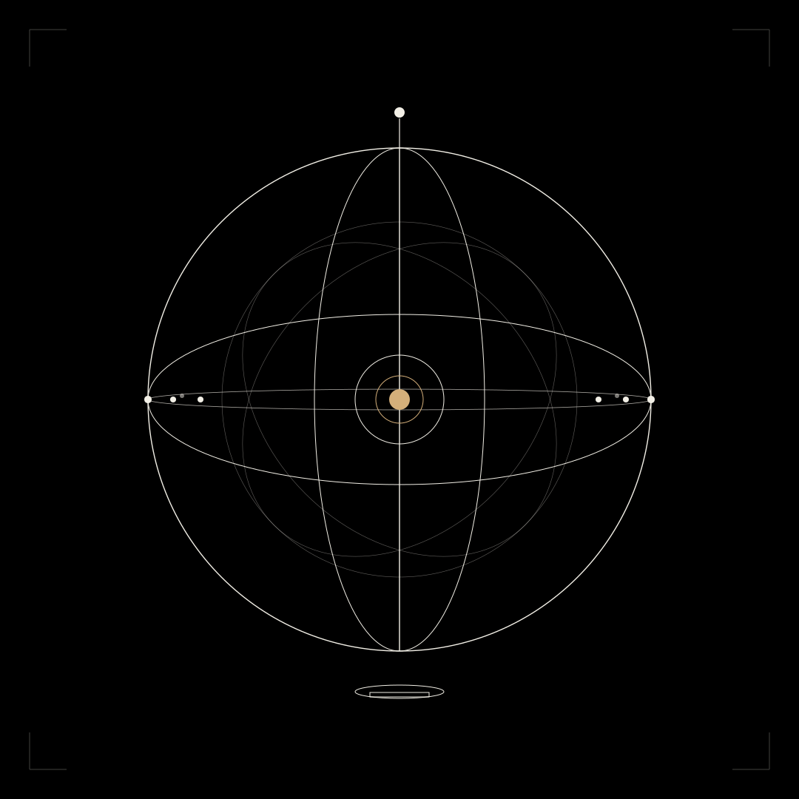

**Sixteen daily marks of the Great Work.**
One image per day, in a fixed register, made to be read in sequence.

---

## On the Sigils

A sigil, in the alchemical tradition, is a single glyph compressing an idea too large to write down at length. The medieval scriptoria knew this well — the manuscripts of the great religious orders were full of marginalia that were not decoration but doctrine, every flourish recording a position the scribes had taken on a question their text could not contain.

The OPUS sigils sit in that lineage. They were not commissioned. They were not made by a designer for a brand book. They were made by the architect of the system, one per day, alongside the engineering work, as a way of forcing each day to resolve into a single image. *If the day could not be drawn, it had not been understood.*

The constraints are deliberate and absolute. Black ground. Cream linework. One — and only one — gold accent. No words. Square format, 1080 by 1080, so the entire set can be read at the same scale. A small bracket motif in each corner, the way an illuminator might frame a folio. Nothing more.

The discipline of the constraints is the point. The colony itself is a study in what a system can do when its agents are not allowed to speak directly to each other but must instead write typed records to a shared substrate. The sigils are the same proposition applied to the maker: every day, the same palette, the same format, the same refusal of ornament. What comes through has to come through the geometry.

Read in sequence, the sixteen pieces compose a short illuminated history of the project's first arc — from the unresolvable mess of the first sketch, through the discovery of the Blackboard and the eight roles, through one fractured day and one labyrinthine one, to the launch and the four shipments that followed. The set is closed at sixteen because every set should be closed somewhere. The sixteenth sigil is left deliberately hollow — a sphere drawn in dashes, with no ember at its heart — and stands for what the colony will do next.

> *Solve et coagula. Dissolve a day into its question; recombine the question into a single mark on black.*

---

## The Visual Grammar

Six glyphs recur across the set. Each has a fixed meaning. Knowing them before reading the sequence is the difference between looking at an illustration and reading a codex.

| Glyph | Meaning |
|---|---|
| **The sphere** | The colony as a single body. Always wireframe — never solid — because the structure is the substance. |
| **The ember** | The gold dot at the centre of the sphere. The Hive Core. The one thing the colony coheres around. The only solid gold in the set. |
| **The diamond** | Knowledge that has survived the Verifier. A Synthesis recorded on the Blackboard. Gold when verified; cream when still under deliberation. |
| **The circle** | An agent. A behaviour, not a service. Hollow because agents are stateless across queries — all state lives elsewhere. |
| **The ledger lines** | Horizontal strokes representing Records on the Blackboard. Always append-only. Always read left to right, top to bottom, oldest first. |
| **Gold** | Reserved for what the colony has accomplished or settled. Never decorative. *If gold appears, something was earned.* |

---

## The Sixteen

Read top to bottom, in the order they were made.

 

### — Sigil I —
## The Sketch
*Day 1 · 28 April · MMXXVI*

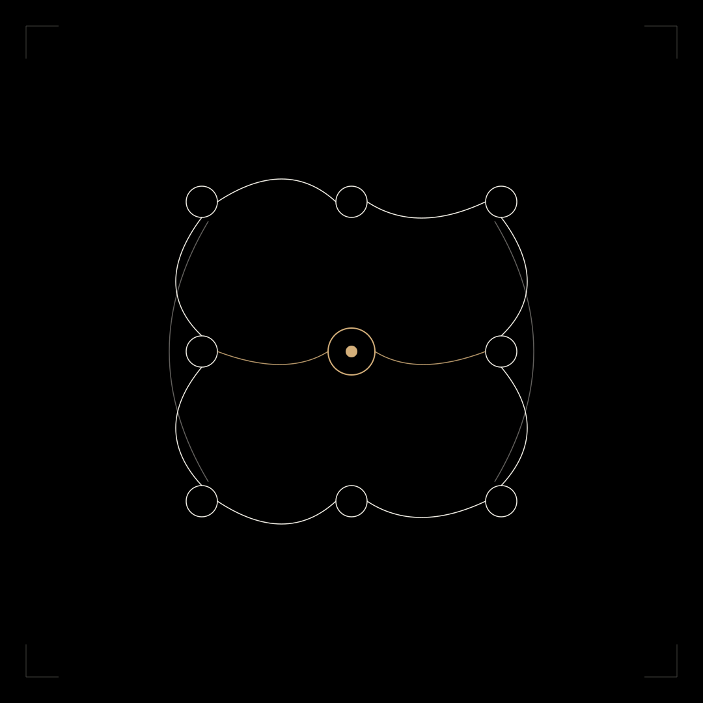

`nine nodes` · `tangled arrows` · `no centre`

The first sigil is deliberately the worst-composed of the set. Nine agents on a grid, every one connected to every other by a different chaotic arc — the mess that a system without a shared substrate becomes. The diagram does not resolve because the architecture it depicts cannot. Everything that follows is an answer to it.

  

### — Sigil II —
## The Three Wheels
*Day 2 · 29 April · MMXXVI*

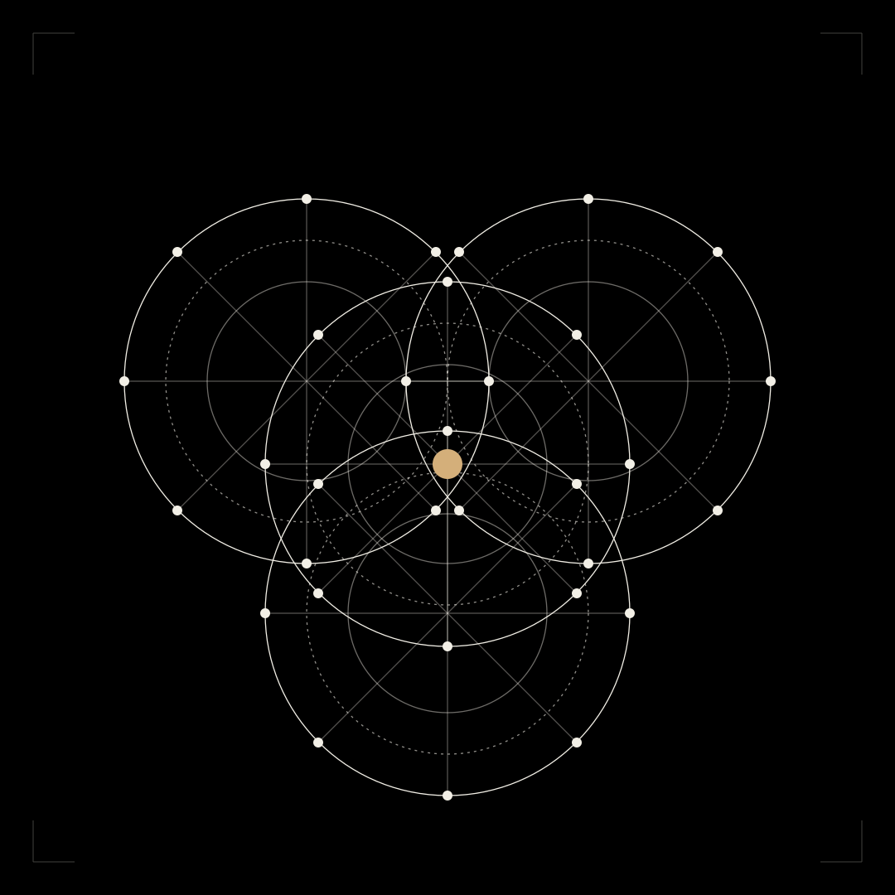

`three Llullian wheels` · `concentric divisions` · `partial overlap`

Three wheels in the manner of Llull, rotated into partial overlap. Each is a separate intellectual lineage — combinatorial generation, blackboard architecture, environmental coordination — and the small region where the three intersect is exactly the territory OPUS proposes to occupy. The sigil records the moment the project stopped feeling derivative and started feeling necessary.

  

### — Sigil III —
## The Mark
*Day 3 · 30 April · MMXXVI*

`armillary sphere` · `beaded equator` · `single gold ember`

The brand mark itself, drawn for the first time. An armillary sphere with a beaded equatorial band and a single gold ember at its centre — the colony as one body, with one heart, observable from every direction. Every subsequent sigil in the set descends from this geometry.

  

### — Sigil IV —
## The Refusal
*Day 4 · 1 May · MMXXVI*

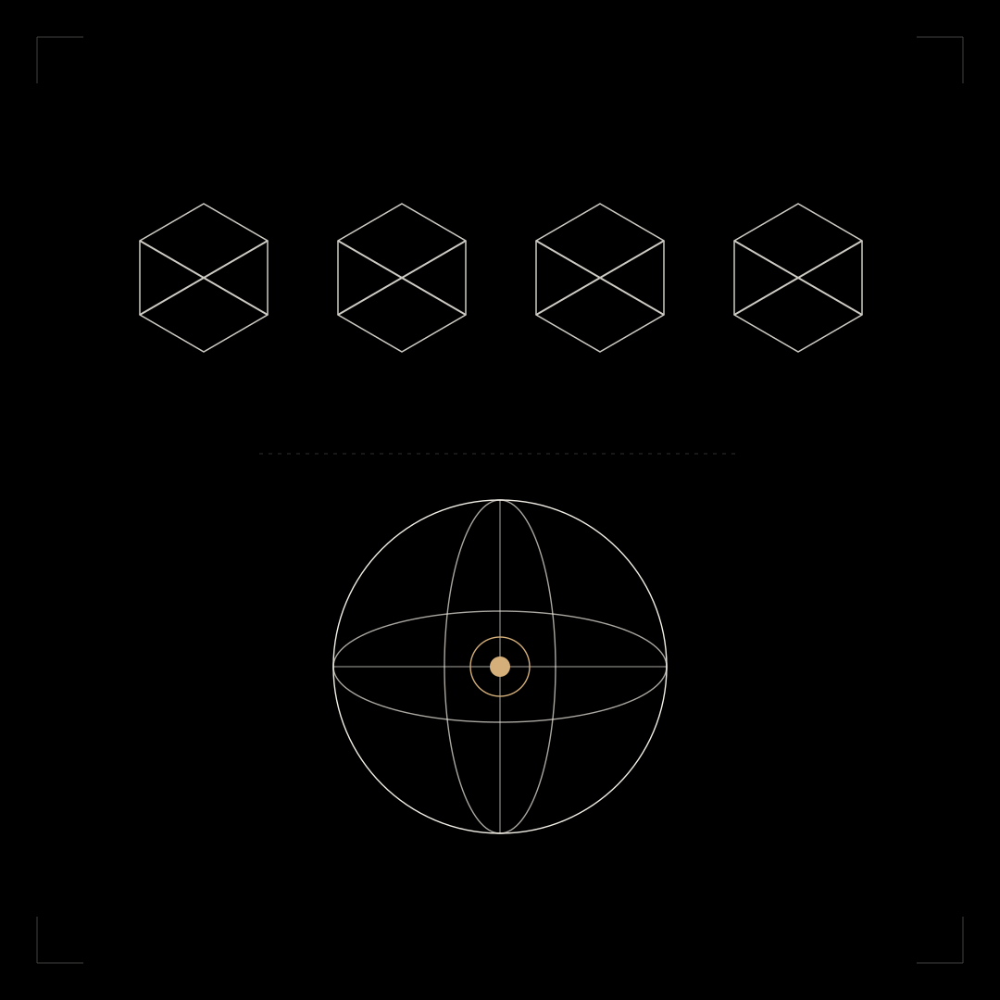

`four crossed-out hexagons` · `one clean sphere`

Four of the existing multi-agent frameworks, each ruled through with a single deliberate line; below them, the OPUS sphere stands intact. The sigil is not a dismissal of prior art but a refusal to inherit its assumptions. Tools for *agents-doing-tasks* were not going to become a system for *agents-deliberating-toward-truth* by accretion.

  

### — Sigil V —
## The Tablet
*Day 5 · 2 May · MMXXVI*

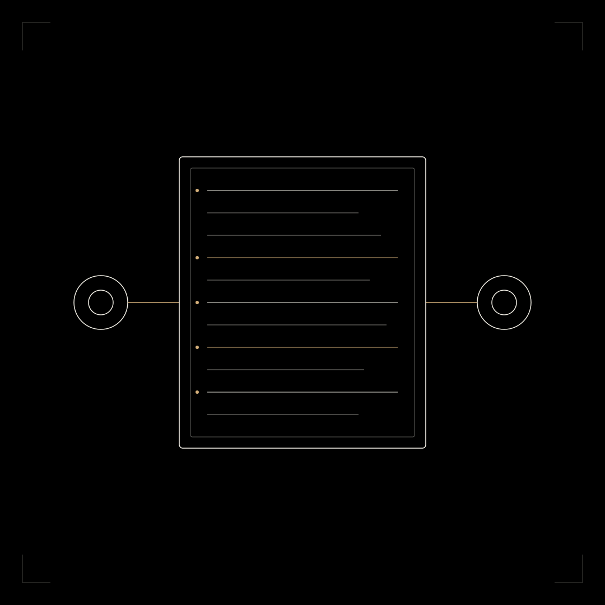

`ledger of horizontal Records` · `two facing agent circles` · `no arrows between them`

Two agents face a shared tablet of typed Records. Crucially, no arrow connects the agents to each other. They speak only through the substrate between them. This is the moment the Blackboard stopped being a metaphor and became a working object — and the moment OPUS could be told apart from any agent framework that came before it.

  

### — Sigil VI —
## The Verdict
*Day 6 · 3 May · MMXXVI*

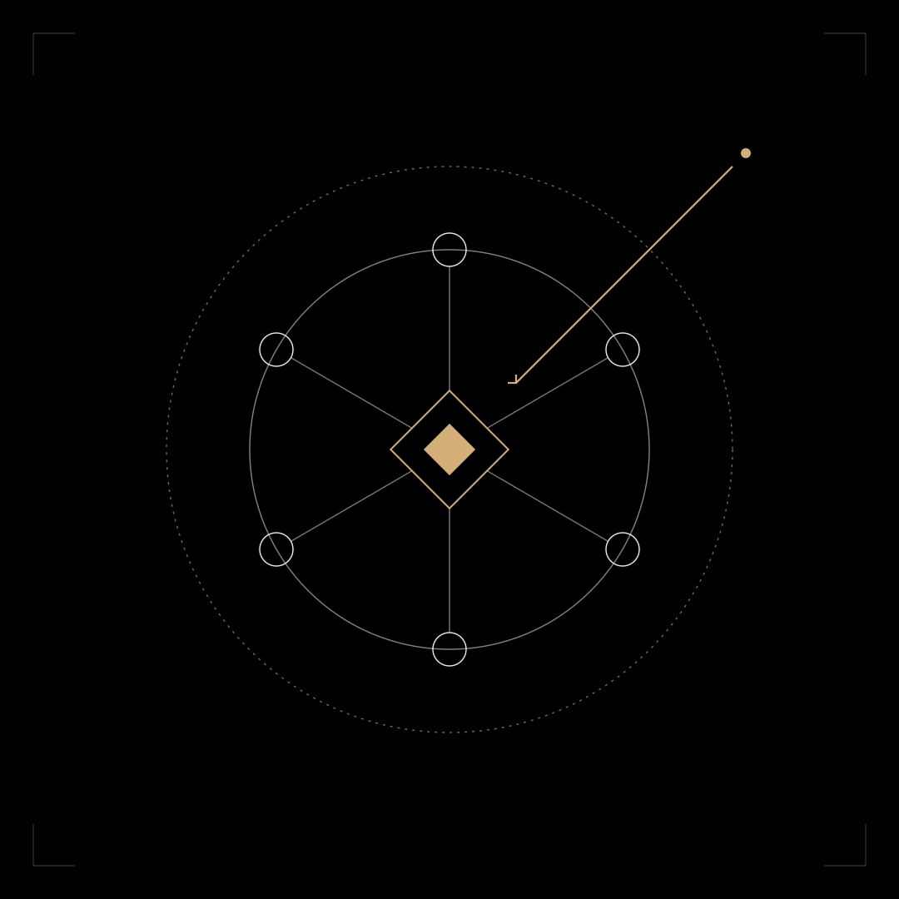

`six voter nodes` · `gold candidate diamond` · `verifier lance from upper right`

A voting wheel — six Workers ranked around a gold diamond representing the leading Synthesis — pierced by a single lance descending from the upper right. The lance is the Verifier, whose only job is to attempt to falsify what the others have just agreed upon. Without it the colony would only be a faster way to be confidently wrong.

  

### — Sigil VII —
## The Fracture
*Day 7 · 4 May · MMXXVI*

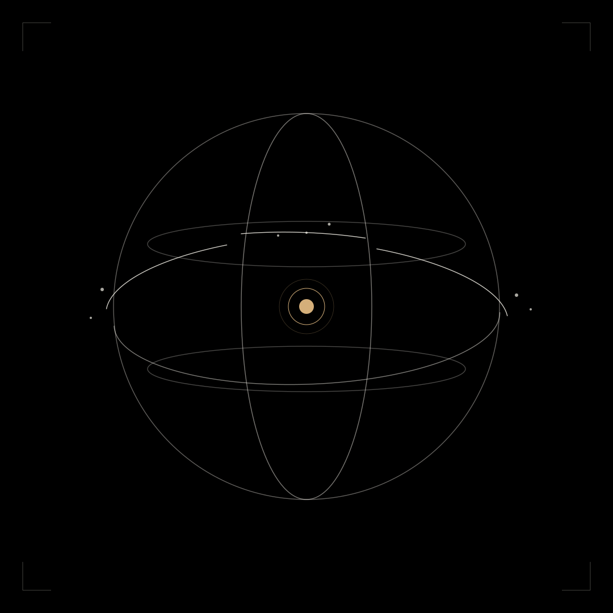

`broken sphere` · `scattered equatorial fragments` · `the ember, still glowing`

The only sigil in the set that depicts damage. The sphere has come apart — meridian rings scattered, the equator broken in arcs — and yet the central ember has not gone out. A day lost to a single SDK migration, recorded honestly. The architecture survived; the day did not.

  

### — Sigil VIII —
## The Eight
*Day 8 · 5 May · MMXXVI*

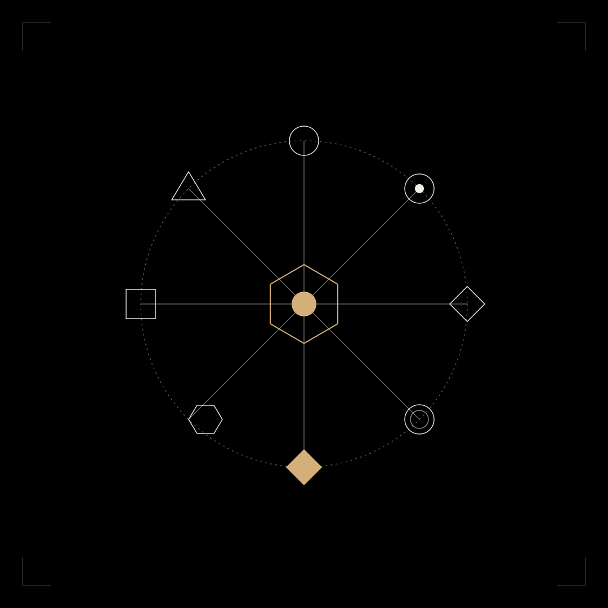

`central hexagonal hive` · `eight role glyphs in orbit`

A hexagonal hive at the centre, with eight distinct glyphs in orbit around it — one for each agent role: Scout, Researcher, Critic, Synthesiser, Verifier, Judge, Planner, Executor. The composition is symmetrical because the system is: every role is a behaviour, not a service, and any one of them can be replaced without disturbing the others.

  

### — Sigil IX —
## The Eighteen
*Day 9 · 6 May · MMXXVI*

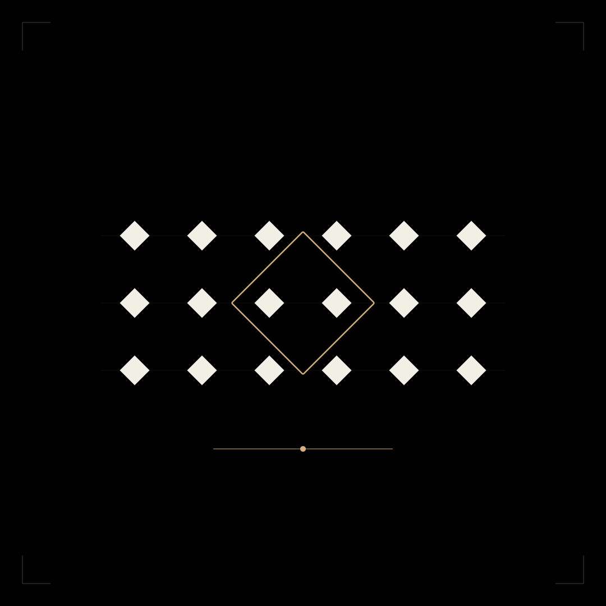

`three rows of six diamonds` · `framing gold ledger`

Eighteen identical small diamonds — one for each unit test in the v0 suite — arranged inside a gold ledger square. Tests as votive offerings; provenance as a kind of devotion. The sigil insists that what makes a system trustworthy is not its eloquence but the boring discipline beneath it.

  

### — Sigil X —
## The Grimoire
*Day 10 · 7 May · MMXXVI*

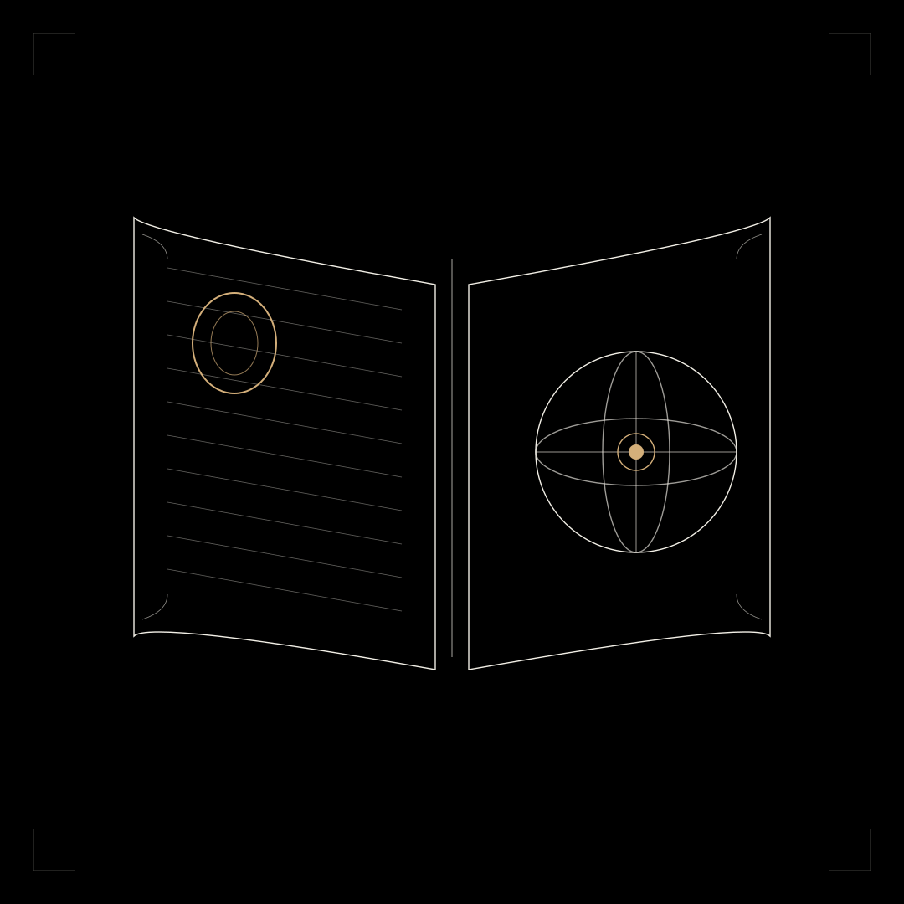

`open codex` · `illuminated initial O` · `armillary sphere on the facing page`

An open book. On the left page, an illuminated O — the historiated initial of OPUS, in the manner of a medieval scriptorium. On the right, the sphere. This sigil marks the decision that the public site would not be a startup landing page but a manuscript: cream on black, Cinzel and Cormorant, monastic spacing, no growth-team furniture.

  

### — Sigil XI —
## The Triptych
*Day 11 · 8 May · MMXXVI*

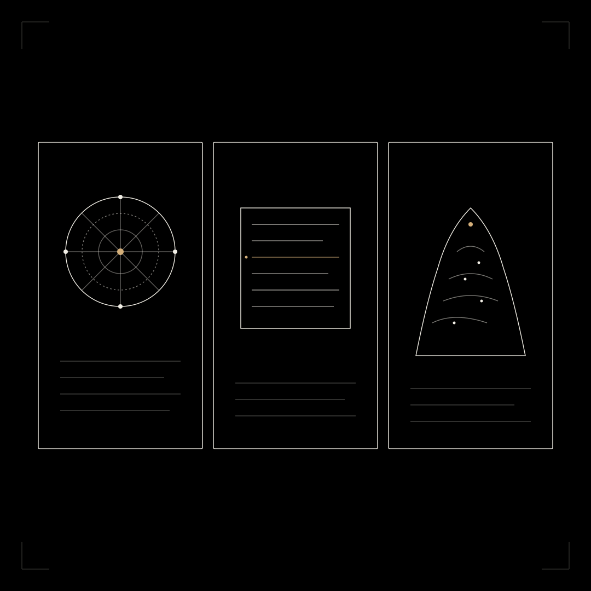

`Llull's wheel` · `the Hearsay-II blackboard` · `a termite mound`

Three panels, hinged. Llull's chamber in Mallorca on the left; Erman and Lesser's blackboard in Pittsburgh in the centre; Grassé's termite mound on the right. The lineage essay drawn as an altarpiece. OPUS does not claim to invent anything in any of these three panels — only to be the first to lay them side by side and read them as one continuous gesture.

  

### — Sigil XII —
## The Labyrinth
*Day 12 · 9 May · MMXXVI*

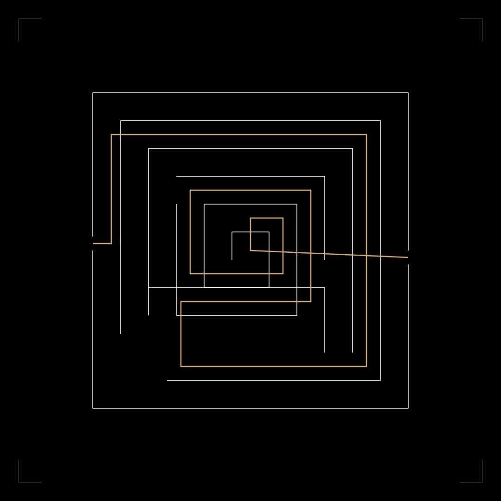

`square maze of dead ends` · `a single gold thread, unbroken`

A square labyrinth with one gold thread tracing the only path through. The day was lost to Windows tooling — PowerShell execution policies, missing Pythons, silent npm failures — and the sigil refuses to pretend otherwise. The path exists. It just took a day to find. Documented now so no one else has to.

  

### — Sigil XIII —
## The Awakening
*Day 13 · 10 May · MMXXVI*

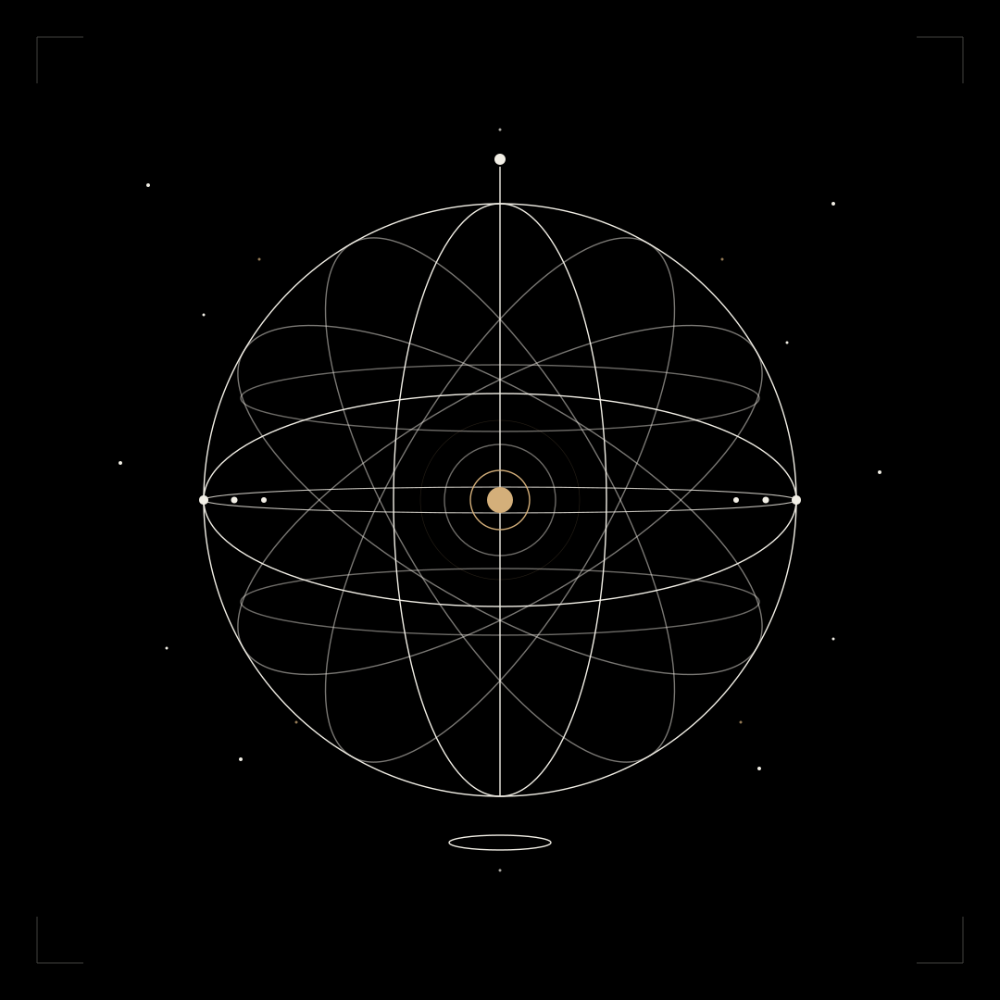

`high-density meridian sphere` · `scattered particle dust` · `pulse around the ember`

The sphere again, but rendered with many more meridians than the original mark — and surrounded by drifting particles caught in its gravity. This is the moment it stopped being an SVG and became a thing alive on the page: React Three Fiber, GLSL fog, a slow heartbeat at the centre. *The brand inhaled.*

  

### — Sigil XIV —
## The Launch
*Day 14 · 11 May · MMXXVI*

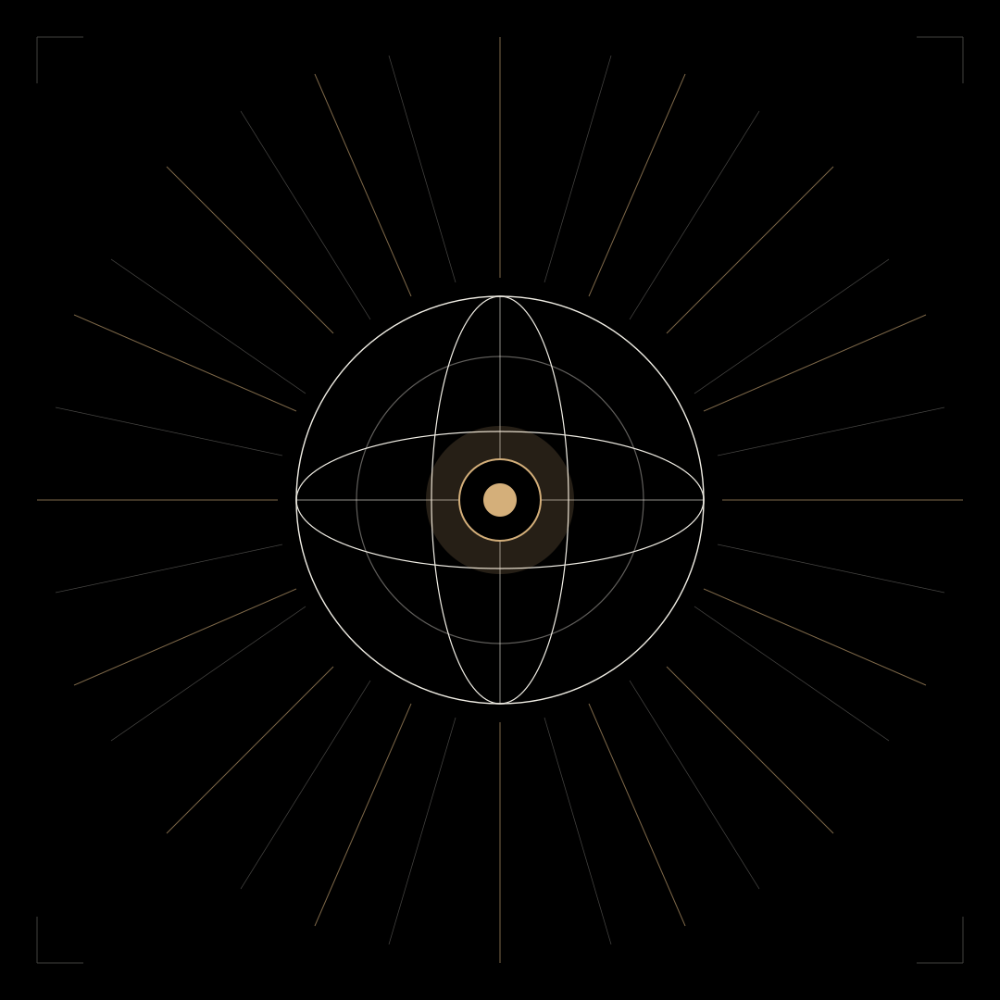

`central sphere` · `sixteen radiating beams`

Sixteen beams of light extend from the sphere — one for each of the daily sigils that will eventually be made. The day opus-core finished end-to-end and the site went live, after an embarrassing number of failed Vercel deploys. The first time the work could be seen by anyone other than the maker.

  

### — Sigil XV —
## The Four
*Day 15 · 12 May · MMXXVI*

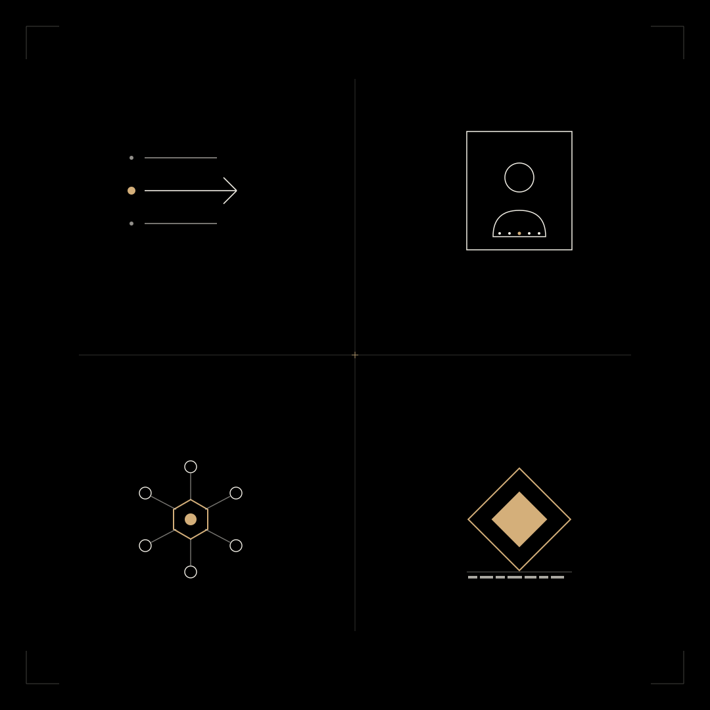

`nav arrows` · `anonymous silhouette` · `swarm dots` · `sealed diamond`

A composition in four quadrants, one per shipment of the day: the top-left nav (arrows), the anonymous architect page (silhouette), the cinematic LiveSwarm (constellation of dots), and the contract address (sealed diamond). The first day with multiple landings — proof the project had become something a stranger could walk into and understand.

  

### — Sigil XVI —
## The Unfinished
*Day N · TBD*

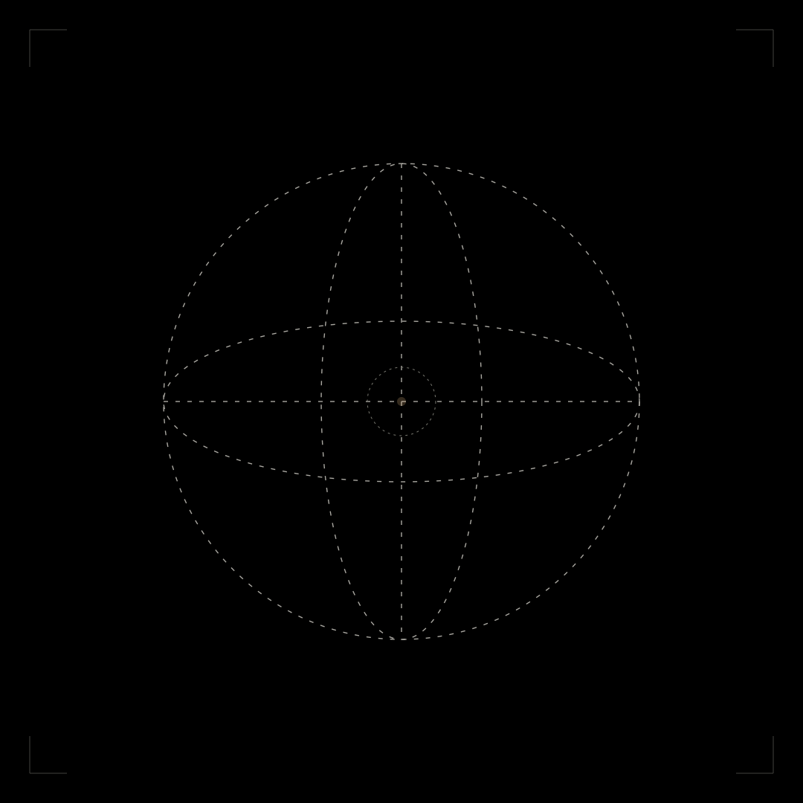

`dashed sphere` · `empty centre`

The set is closed at sixteen because every set should be closed somewhere — but the final sigil is drawn in dashes, with no ember at its heart. It stands for whatever the colony does next: opus-core on Modal, real Records streaming into the browser, a public deliberation any visitor can pose a question to. *The sphere is hollow on purpose. The work continues.*

 

---

## The Complete Codex

All sixteen sigils are bundled as a single archive for download, printing, or remixing:

**[↓ opus-sigils.zip](opus-sigils.zip)** &nbsp;·&nbsp; ~14 KB &nbsp;·&nbsp; sixteen 1080×1080 SVGs

Or browse the individual files in this folder: [`sigil-i.svg`](sigil-i.svg) → [`sigil-xvi.svg`](sigil-xvi.svg).

---

## Provenance

- **Author**: `0pusAI`, architect of OPUS
- **Period**: 28 April – 12 May · MMXXVI (one sigil per day, alongside the build)
- **Medium**: hand-composed SVG, 1080×1080, 3 colours (black `#000000` · cream `#F2EFE6` · gold `#D4AF7A`)
- **Licence**: MIT, same as the rest of OPUS — see [`LICENSE`](../../LICENSE)

---

*Magnum Opus · MMXXVI*

[← back to repository root](../../) &nbsp;·&nbsp;
[whitepaper](../../docs/whitepaper.md) &nbsp;·&nbsp;
[live site](https://www.tryopusai.com)

