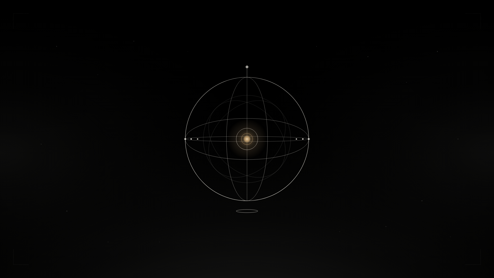
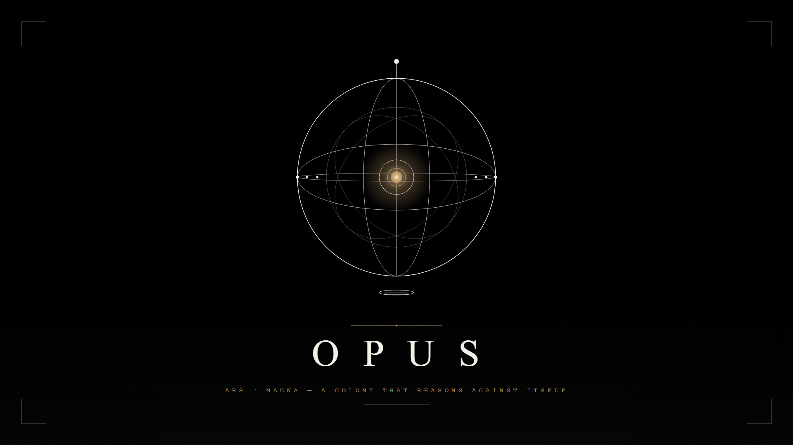

<div align="center">

# OPUS — Teaser Storyboard

### *Start frame · End frame · 10s commercial*

— § Lore · Production · MMXXVI —

</div>

---

Two keyframes for the OPUS commercial teaser. Designed in the project's exact visual register (cream linework on black, one accent of gold, corner brackets, armillary sphere) at native cinematic 1920×1080 / 16:9.

Intended workflow: **feed both PNGs into Veo 3.1 as start-frame and end-frame conditioning, with the master prompt below.** Veo interpolates the motion between them and generates synced audio in the same pass.

---

## The two frames

| Frame | File | Role |
|---|---|---|
| **Start (0:00)** | [`frame-start.png`](frame-start.png) · [`frame-start.svg`](frame-start.svg) | Armillary sphere emerging from volumetric fog. Gold ember at the centre is the only fully bright element. Dust motes drift. Corner brackets are barely there — nothing has resolved yet. |
| **End (0:10)** | [`frame-end.png`](frame-end.png) · [`frame-end.svg`](frame-end.svg) | Sphere fully resolved, raised slightly to make room for type. Below it, a hairline gold divider, then the **O P U S** wordmark in serif capitals, then the gold monospaced subtitle *"ARS · MAGNA — A COLONY THAT REASONS AGAINST ITSELF"*. Corner brackets at full presence. |

<div align="center">
  
  &nbsp;
  
</div>

---

## The master prompt (Veo 3.1)

> A cinematic 10-second commercial teaser in the visual register of an illuminated alchemical manuscript. Deep matte black background. Cream-white linework only. One single accent of warm 24-karat gold. No other colors at any point.
>
> **0:00–0:03 —** Slow push-in through drifting volumetric fog. From the dark, an armillary sphere emerges: a wireframe globe of cream-white meridian rings with a beaded equatorial band. At its exact centre, a small gold ember pulses once, slowly, like a heartbeat. Dust motes drift across the lens. Anamorphic, shallow depth of field.
>
> **0:03–0:07 —** The camera pulls back. Around the sphere, nine small cream-white points of light orbit in concentric tiers — three at the outer perimeter, six in a middle ring. They write luminous horizontal lines into a glowing tablet beneath the sphere (the Blackboard). The lines accumulate. One of the orbiting points turns gold for a fraction of a second — a verdict.
>
> **0:07–0:10 —** The orbit collapses inward. The gold ember at the centre brightens and steadies. The fog clears. Centered text materializes in elegant serif capitals: **O P U S**. Below it, in monospaced gold: *ARS · MAGNA — A COLONY THAT REASONS AGAINST ITSELF*.
>
> Audio: a low cinematic drone in C minor builds across the clip. A single struck bell at 0:07. At 0:08, a hushed whispered male voiceover, slightly reverbed: *"Dissolve the one mind into many. Recombine the many into one well-considered answer."*
>
> Style: shot on Arri Alexa 65, anamorphic 2.39:1, monastic, Tarkovsky patience, no kinetic camera moves, every motion slow and deliberate. Reference: the opening of Blade Runner 2049 crossed with a medieval illuminated manuscript.

---

## Re-rendering the PNGs

The PNGs are baked at 1920×1080 from the SVG sources via headless Chrome — no extra tooling required.

```powershell
# From the repo root
$chrome = 'C:\Program Files\Google\Chrome\Application\chrome.exe'
$dir    = "$PWD\lore\teaser"
& $chrome --headless=new --disable-gpu --hide-scrollbars `
    --screenshot="$dir\frame-start.png" --window-size=1920,1080 `
    "file:///$($dir -replace '\\','/')/_render-start.html"
& $chrome --headless=new --disable-gpu --hide-scrollbars `
    --screenshot="$dir\frame-end.png" --window-size=1920,1080 `
    "file:///$($dir -replace '\\','/')/_render-end.html"
```

The `_render-*.html` wrappers exist only so Chrome renders the SVGs full-bleed without browser chrome.

---

## Alternatives

- **Seedance 2.0** — feed the same PNGs as start/end frames with the prompt above, but skip the audio direction (Seedance has no native audio; score it in DaVinci with Suno + ElevenLabs).
- **Concept-art upgrade pass** — hand the PNGs to **Imagen 4** or **Midjourney v7** as style references with the prompt: *"Photorealistic cinematic still, Arri Alexa 65, anamorphic 2.39:1, the composition shown in the reference exactly preserved."* Then feed the upgraded photoreal stills into Veo for the final video.

---

<div align="center">

*Magnum Opus · MMXXVI*

[← back to lore](../) &nbsp;·&nbsp;
[the sigils](../sigils/) &nbsp;·&nbsp;
[autogenesis](../autogenesis/)

</div>
